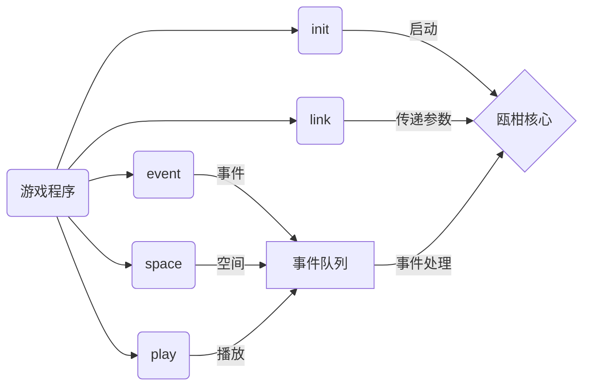

# 可行性分析
## 需求
### 功能
在游戏中加载一个新的音频线程，用来处理音频事务  
目前计划使用事件队列  
在游戏主程序中调用函数（事件，空间，播放音频）  
可以往事件队列中添加新的事件  
### 使用
* init，初始化
* event，控制：操控器
* space，控制：文件加载
* play，控制：播放音频
* link，传输参数给传递器（没想好）
## 工作流程

## 解决
### 自行解决
必须要解决editor和middleware共用的音频核心