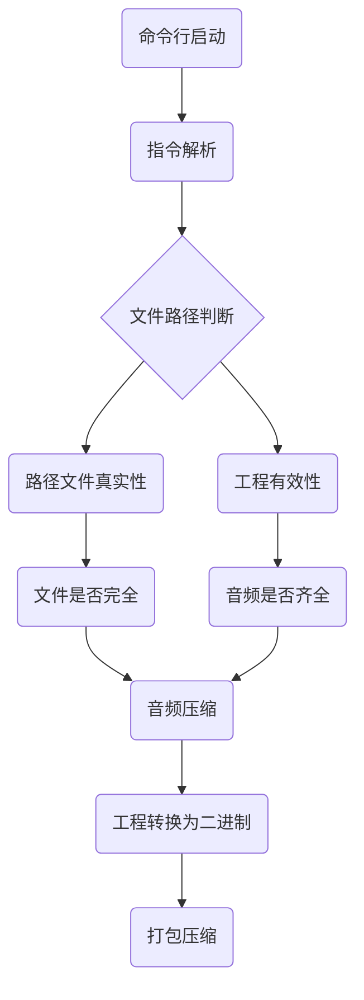

# 设计
## 开发
cpp版本20  
c版本89  
使用[谷歌代码风格](https://zh-google-styleguide.readthedocs.io/en/latest/google-cpp-styleguide/contents/) 
## 流程

```mermaid
graph TB
    A(命令行启动) -->B(指令解析) -->C{文件路径判断} 
    C -->D(路径文件真实性)
    D -->E(文件是否完全)
    C -->F(工程有效性)
    F -->G(音频是否齐全)
    E -->H(音频压缩)
    G -->H
    H -->I(工程转换为二进制)
    I -->J(打包压缩)
```
## 拆分