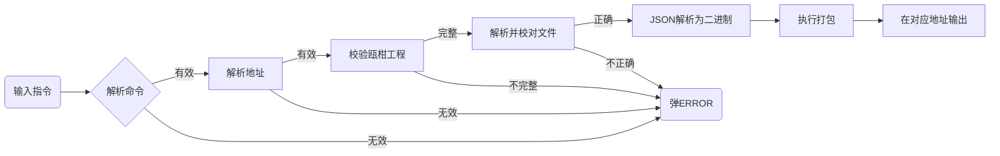

# 可行性分析
## 包
包中含有：
* 有损压缩后的音频文件
* 标记音频和调音台的序列化文件
* 调音台插件动态链接库

```
包
├── 音频文件夹 "sounds"
├── 序列化文件 "serialization" (还需要调研)
└── 动态链接库文件夹 "dll"
```
压缩方式默认使用lz4hc，音频压缩方式默认使用ogg  
音频参数默认为44100hz，16bit  

## 需求
### 功能
将原始音频，json，音效插件打包。  
原始音频压缩为特定格式，  
json转换为二进制文件，  
音效插件为对应平台动态链接库。
### 使用
使用命令行对操作程序。  
```
-i [目录/文件] 
-o [目录]
-d (alac m4a 44100 16bit zip)
-e [参数]
-f [参数]
-s [参数]
-a [参数]
-p [参数]
-h / -help
```
必须输入输入地址和输出地址，  
其他参数可以使用default选择默认参数。
### 外观
需要命令行进度条和压缩文件名同时滚动的画面（前者可以抛弃）
### 性能
使用电脑上所有线程压缩音频，使速度达到最大。
### 支持平台
Windows和Linux。如果有时间搭建Mac开发环境考虑支持Mac。
## 工作流程

## 解决
### 自行解决
* 地址有效性判断 每个平台单独写
* 工程文件有效性判断
### 使用库
* 命令行解析 CLI11
* json
* 反序列化/序列化 [yas](https://github.com/niXman/yas)
* 音频有损压缩 alac(经测试压缩后体积太大，放弃)
* 音频有损压缩 [ogg](https://github.com/xiph/ogg)
* 编解码器 [opus](https://github.com/xiph/opus)
* 文件压缩 [lz4hc](https://github.com/lz4/lz4)，[zlib-ng](https://github.com/zlib-ng/zlib-ng)